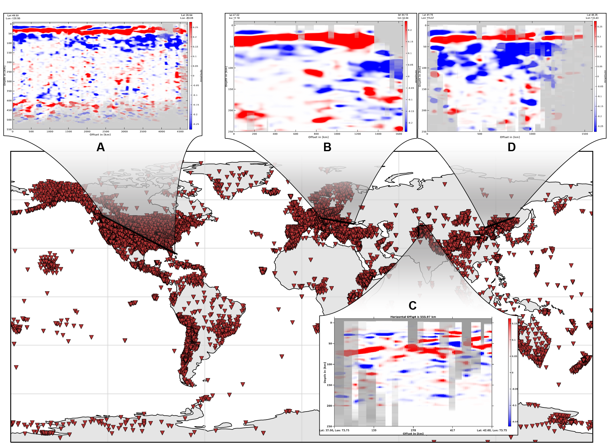
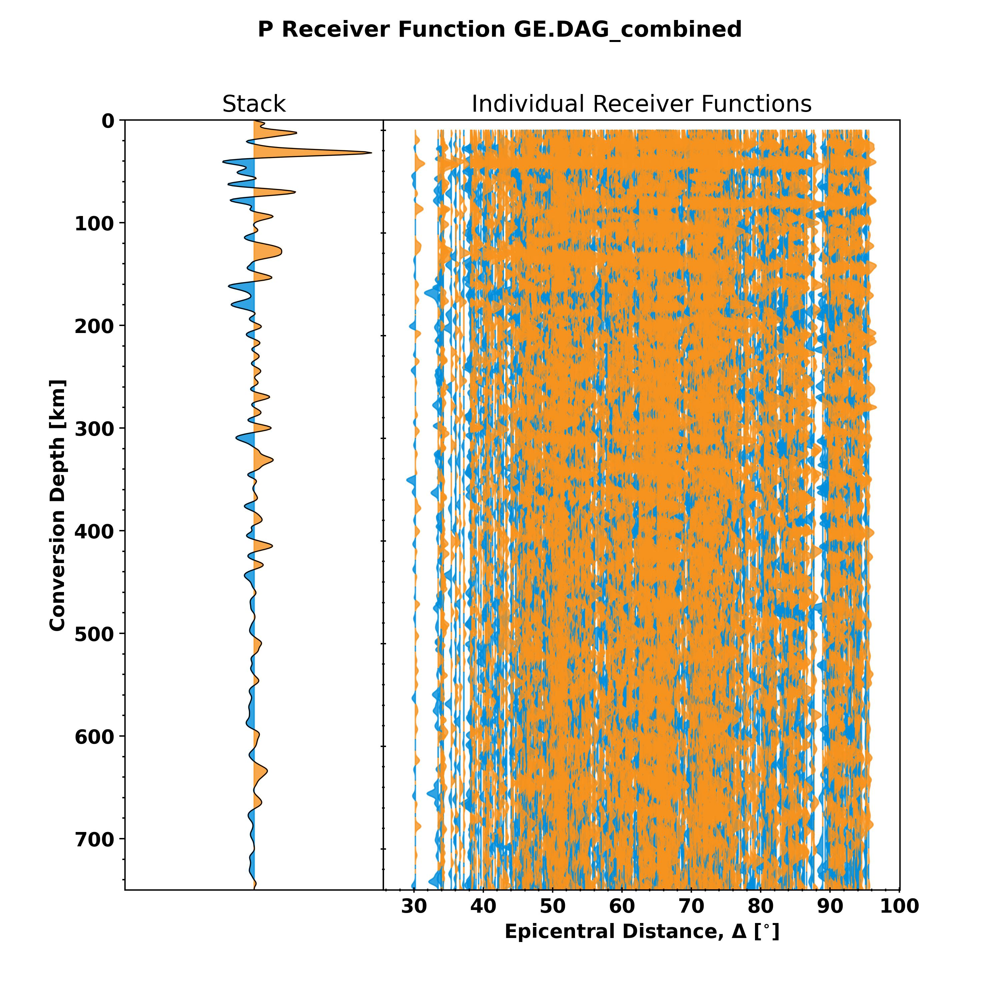

[](https://github.com/PeterMakus/PyGLImER/actions/workflows/test_on_push.yml) [](https://github.com/PeterMakus/PyGLImER/actions/workflows/deploy_gh_pages.yml) [](https://www.gnu.org/licenses/lgpl-3.0) [](https://codecov.io/gh/PeterMakus/PyGLImER)

---

## A workflow to create a global database for Ps and Sp receiver function imaging of crustal and upper mantle discontinuties 

This project was created in the framework of a Master's thesis by Peter Makus.
It aims to **automate receiver function (RF) processing from download of raw waveform data to common conversion point (CCP) imaging with a minimum amount
of user interference.**
It is largely based on the [ObsPy](https://github.com/obspy/obspy) project and can be seen as a more powerful and user-friendly
successor of the [GLImER](http://stephanerondenay.com/glimer-web.html) project.

## Installation of this package

A few simple steps:

```bash
# Change directory to the same directory that this repo is in (i.e., same directory as setup.py)
cd $PathToThisRepo$

# Create the conda environment and install dependencies
conda env create -f environment.yml

# Activate the conda environment
conda activate PyGLImER

# Install your package
pip install -e .
```

## Getting started
Access PyGLImER's documentation [here](https://petermakus.github.io/PyGLImER/).

PyGLImER comes with a few tutorials (Jupyter notebooks). You can find those in the `examples/` directory.

## What it looks like
With PyGLImER, we facilitate processing extremely large amounts of teleseismic data. This enables us to create large scale CCP sections as shown for P-to-S and S-to-P receiver function data in the plot below:

|  |
|:--:| 
| *Seismic broadband stations with available receiver functions are plotted as downward-pointing red triangles. The locations of the shown cross-sections are demarked as bold black lines. Cross-sections A, B, and D are created from S receiver functions stacked by common conversion point, whereas cross-section C shows a slice through a P receiver function common conversion point stack. Data begin to fade to grey if the respective gridpoint is hit by fewer than 25 rays. Note that the vertical exaggeration varies from panel to panel.* |

PyGLImER also comes with a toolset to create publication ready figures:


*Single station stack and receiver functions sorted by epicentral distance from P receiver function for station IU.HRV.*


*Distribution of back-azimuth and rayparameter for the receiver functions above.*

## Reporting Bugs / Contact the developers
This version is an early release. If you encounter any issues or unexpected behaviour, please [open an issue](https://github.com/PeterMakus/PyGLImER/issues/new) here on GitHub or [contact the developers](mailto:makus@gfz-potsdam.de).

## Citing PyGLImER
If you use PyGLImER to produce content for your publication, please consider citing us. For the time being, please cite our [AGU abstract](https://www.essoar.org/doi/10.1002/essoar.10506417.1).

## Latest
We are happy to announced that PyGLImER has been awarded an [ORFEUS](http://orfeus-eu.org/) software development grant and are looking forward to further develop this project.
