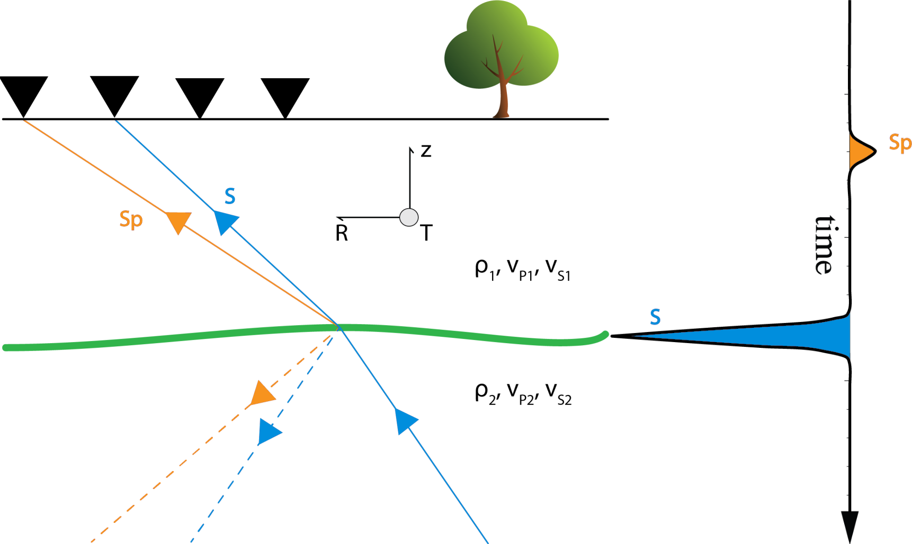

Introduction 
------------ 

PyGLImER automates receiver function (RF) processing from download of raw waveform data to common conversion point (CCP)
imaging with a minimum amount of user interference.

The implementation includes:

+ Functions to download raw waveform data from FDSN providers
+ Functions to feed in local waveform data
+ An adaptable preprocessing scheme, including various rotational algorithms
+ A variety of deconvolution algorithms (user-defined algorithms possible)
+ An implementation of the iasp91 and GyPSum velocity models for depth migration (user-defined models are accepted)
+ A new, particularly efficient Common Conversion Point Stacking algorithm
+ A variety of plotting tools to explore datasets and to create prublication ready figures
+ Efficient and fast processing and data management, support multi-processing, MPI, and HDF5

As developers, we are particularly concerned to create an automated, adaptable, efficient, and, yet, easy-to-use toolkit.

The project is relying on an `ObsPy-like <https://github.com/obspy/obspy>`_ API and can be seen as a more powerful and
user-friendly successor of
`the GLImER project <https://www.stephanerondenay.com/glimer-map/map.html>`_.

A review of the receiver function technique is given here: `Upper Mantle Imaging
with Array Recordings of Converted and Scattered Teleseismic Waves
<https://link.springer.com/article/10.1007/s10712-009-9071-5>`_

    **(left)** *A cartoon of a conversion of an incoming teleseismic S arrival and its conversion at a boundary below a seismic array.*
    **(right)** *The resulting seismogram. One can create a receiver function by confining the conversion/coda and the primary arrival
    to each one component (rotation) and, subsequently, deconvolving the primary wavelet from the converted wavelet.*
