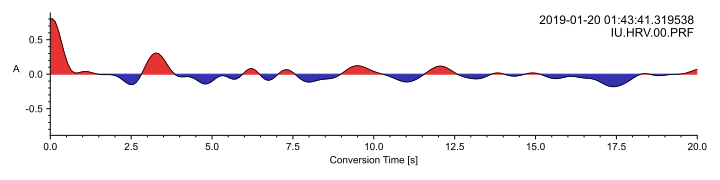
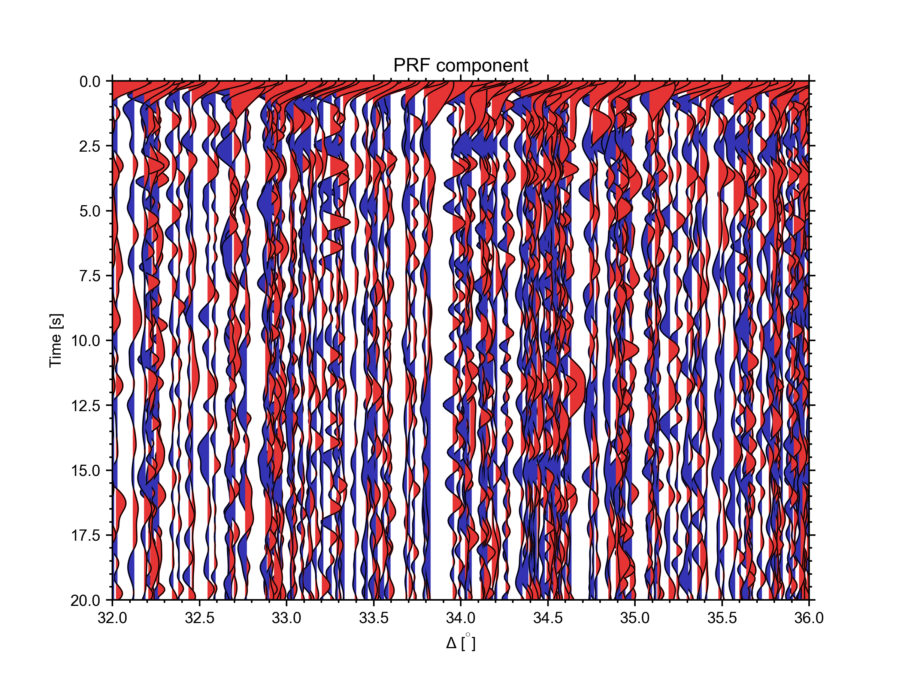
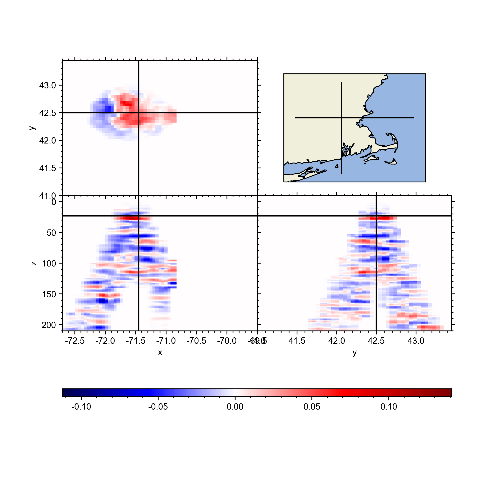

Plotting
++++++++

Here we can start putting all the plotting tools, and actual example plots
that look good and not those tiny weird looking jupyter notebook plots.

We'll still use the exact same routines and codes.

Single Receiver Function
------------------------

Given the data downloaded using the example notebook for data collection, we
can simply read and plot them using

.. code-block:: python
    :linenos:

    from pyglimer.plot.plot_utils import set_mpl_params
    from pyglimer.plot.plot_utils import plot_single_rf
    from pyglimer.rf.create import read_rf
    set_mpl_params()

    # Read all RFs from Station IU/HRV
    rfst = read_rf("../database/waveforms/RF/P/IU/HRV/*.sac")

    # Some random RF from the 800 avalable one at IU.HRV
    N = 753

    # Plot RF and save its output.
    plot_single_rf(rfst[N])

which results in the following image:

.. image:: figures/IU.HRV.00.PRF_raw.svg

We can time limit the figure as well

.. code:: python

    plot_single_rf(rfst[N], tlim=[0, 20])

which cuts out the RF between 0 and 20 seconds

If you feel artsy and only want the trace

.. code:: python

    plot_single_rf(rfst[N], tlim=[0, 20], clean=True)

which removes all labels, axes etc.

Receiver Function Section
-------------------------

We can plot all receiver functions in an ``RFStream`` into a section depending 
on epicentral distance.

.. code-block:: python

    # Plot section
    plot_section(rfst, scalingfactor=1)

This plots all available RFs in the Stream into a section

.. image:: figures/section_raw.png

Also this plot can be limited using the right arguments

.. code-block:: python
    :linenos:

    # Plot section with limits
    timelimits = (0, 20)  # seconds
    epilimits = (32, 36)  # epicentral distance
    plot_section(rfst, scalingfactor=0.25, linewidth=0.75,
                 timelimits=timelimits, epilimits=epilimits)

which provides a more detailed view of the receiver functions

CCP Stack Plotting
------------------

The stacks computed and saved by the routines have a few built-in plotting 
tools for simple visualization

Volume Sections
===============

Here we compute a CCP volume first and subsequently slice through it by simply 
taking slices from a 3D matrix.

.. code-block:: python
    :linenos:

    from pyglimer.ccp.ccp import read_ccp
    from pyglimer.plot.plot_utils import set_mpl_params
    import matplotlib.pyplot as plt
    set_mpl_params()

    # Read the CCP Stack
    ccpstack = read_ccp(filename='../ccp_IU_HRV.pkl', fmt=None)

    # Create spacing
    lats = np.arange(41, 43.5, 0.05)
    lons = np.arange(-72.7, -69.5, 0.05)
    z = np.linspace(-10, 200, 211)

    # Plot volume slices: vplot is a VolumePlot object
    vplot = ccpstack.plot_volume_sections(
        lons, lats, zmax=211, lonsl=-71.45, latsl=42.5, zsl=23)
                

Cross Section
=============

We can build cross sections without actually compute a full volume. This is
done (like the computation of the fiull volume) by using a KDTree that 
provides weighted nearest neighbour interpolation on a sphere.

.. code-block:: python
    :linenos:

    import numpy as np
    from pyglimer.ccp.ccp import read_ccp
    from pyglimer.plot.plot_utils import set_mpl_params
    import matplotlib.pyplot as plt
    set_mpl_params()

    # Read the CCP Stack
    ccpstack = read_ccp(filename='../ccp_IU_HRV.pkl', fmt=None)

    # Create points waypoints for the cross section
    lat0 = np.array([42.5, 42.5])
    lon0 = np.array([-72.7, -69.5])
    lat1 = np.array([41.5, 43.5])
    lon1 = np.array([-71.45, -71.45])

    # Set RF boundaries
    mapextent = [-73.5, -69, 41, 44]
    depthextent = [0, 200]
    vmin = -0.1
    vmax = 0.1

    # Plot cross sections
    ax1, geoax = ccpstack.plot_cross_section(
        lat0, lon0, z0=23, vmin=vmin, vmax=vmax,
        mapplot=True, minillum=1, label="A",
        depthextent=depthextent,
        mapextent=mapextent)
    ax2, _ = ccpstack.plot_cross_section(
        lat1, lon1, vmin=vmin, vmax=vmax,
        geoax=geoax, mapplot=True,
        minillum=1, label="B",
        depthextent=depthextent
    )

    plt.show()

This snippet creates a map including the illumination

.. image:: figures/cross_section_map.png

and the respective cross sections A

.. image:: figures/cross_section_A.png

and B

.. image:: figures/cross_section_B.png