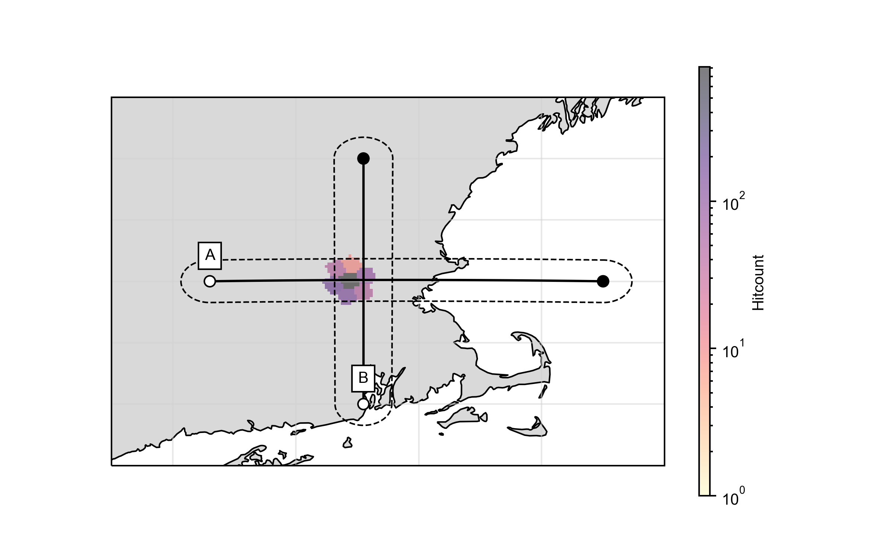

CCP Stack Plotting
------------------

The stacks computed and saved by the routines have a few built-in plotting 
tools for simple visualization

Volume Sections
===============

Here we compute a CCP volume first and subsequently slice through it by simply 
taking slices from a 3D matrix.

.. code-block:: python
    :linenos:

    from pyglimer.ccp.ccp import read_ccp
    from pyglimer.plot.plot_utils import set_mpl_params
    import matplotlib.pyplot as plt
    set_mpl_params()

    # Read the CCP Stack
    ccpstack = read_ccp(filename='../ccp_IU_HRV.pkl', fmt=None)

    # Create spacing
    lats = np.arange(41, 43.5, 0.05)
    lons = np.arange(-72.7, -69.5, 0.05)
    z = np.linspace(-10, 200, 211)

    # Plot volume slices: vplot is a VolumePlot object
    vplot = ccpstack.plot_volume_sections(
        lons, lats, zmax=211, lonsl=-71.45, latsl=42.5, zsl=23)
                
.. image:: figures/ccp_volume.png

Cross Section
=============

We can build cross sections without actually compute a full volume. This is
done (like the computation of the fiull volume) by using a KDTree that 
provides weighted nearest neighbour interpolation on a sphere.

.. code-block:: python
    :linenos:

    import numpy as np
    from pyglimer.ccp.ccp import read_ccp
    from pyglimer.plot.plot_utils import set_mpl_params
    import matplotlib.pyplot as plt
    set_mpl_params()

    # Read the CCP Stack
    ccpstack = read_ccp(filename='../ccp_IU_HRV.pkl', fmt=None)

    # Create points waypoints for the cross section
    lat0 = np.array([42.5, 42.5])
    lon0 = np.array([-72.7, -69.5])
    lat1 = np.array([41.5, 43.5])
    lon1 = np.array([-71.45, -71.45])

    # Set RF boundaries
    mapextent = [-73.5, -69, 41, 44]
    depthextent = [0, 200]
    vmin = -0.1
    vmax = 0.1

    # Plot cross sections
    ax1, geoax = ccpstack.plot_cross_section(
        lat0, lon0, z0=23, vmin=vmin, vmax=vmax,
        mapplot=True, minillum=1, label="A",
        depthextent=depthextent,
        mapextent=mapextent)
    ax2, _ = ccpstack.plot_cross_section(
        lat1, lon1, vmin=vmin, vmax=vmax,
        geoax=geoax, mapplot=True,
        minillum=1, label="B",
        depthextent=depthextent
    )

    plt.show()

This snippet creates a map including the illumination

and the respective cross sections A

.. image:: figures/cross_section_A.png

and B

.. image:: figures/cross_section_B.png